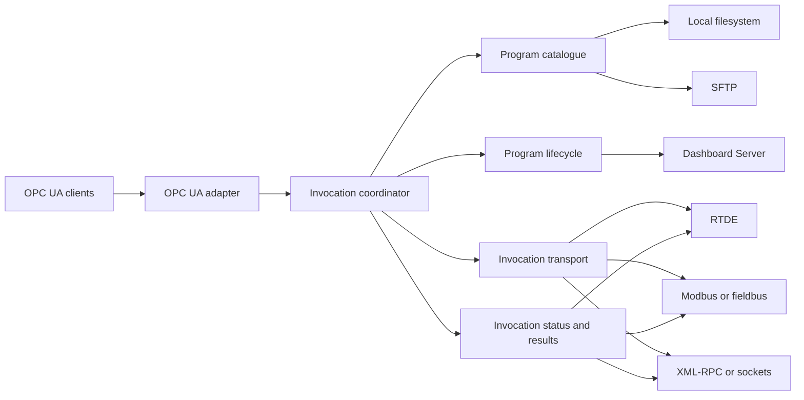
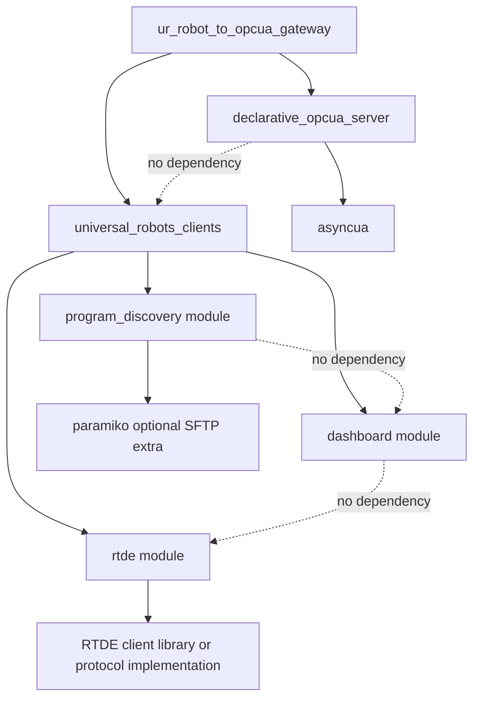

# Multi-Protocol Robot Gateway Architecture

## Purpose

This report considers how program invocation arguments change the gateway from a Dashboard-only robot integration into a composition of multiple robot-facing
protocols. It defines a protocol-neutral application boundary, recommends an initial Dashboard-plus-RTDE implementation, and explains how that direction
intersects with the two reusable distributions now staged beneath `packages/` and documented in [reusable package extraction](reusable-package-extraction.md).

This is a design proposal rather than a description of current behavior. The current MVP still uses local or SFTP discovery, Dashboard control, and OPC UA
exposure without parameterized invocations.

## Summary

The Dashboard Server should become one robot-facing adapter rather than define the whole gateway. Its responsibility remains program and controller lifecycle:
load, play, pause, stop, and state queries. A separate invocation transport should stage arguments, signal that an invocation is ready, receive robot
acknowledgement, and publish execution status or results.

The gateway should therefore compose capabilities rather than assume that one protocol provides everything:

```text
Program catalogue       Local filesystem or SFTP
Program lifecycle       Dashboard Server
Invocation transport    RTDE initially; Modbus, XML-RPC, sockets, or fieldbus later
Client API               OPC UA
Execution policy         Gateway application
```

The recommended first implementation is:

- Dashboard for loading, starting, pausing, stopping, and controller state.
- RTDE for argument values, invocation identifiers, ready and acknowledgement handshakes, state, and simple results.
- A gateway-owned invocation coordinator that is independent of both protocols.
- One stable OPC UA model that does not expose which robot protocol carries each operation.

Once this exists, `ur_dashboard_to_opcua_gateway` will be too narrow as a product name. `ur_robot_to_opcua_gateway` is the strongest current replacement, but
the rename should happen only after a second robot-facing protocol works end to end.

## Architectural boundary



This is a ports-and-adapters boundary in practical terms, but it does not require a class-heavy framework. The ports can remain configured functions, callable
dictionaries, immutable dataclasses, or small resource-owning clients where a persistent connection makes state unavoidable.

## Application capabilities

### Program catalogue

The catalogue answers which programs or tasks are available and provides stable identifiers and metadata. It does not control the robot or decide how arguments
are transported.

Conceptual operations:

```text
list_programs()
read_program_metadata(program)
refresh_programs()
```

Local and SFTP discovery remain interchangeable implementations of this capability.

### Program lifecycle

Lifecycle control applies to the robot controller and loaded program:

```text
load_program(program)
start_program()
pause_program()
stop_program()
read_loaded_program()
read_controller_state()
```

The Dashboard Server is the initial implementation. These operations should not contain argument staging, task-schema interpretation, or OPC UA node creation.

### Invocation transport

The invocation transport exchanges application data with robot-side code:

```text
stage_arguments(invocation_id, schema, values)
commit_invocation(invocation_id)
wait_for_acknowledgement(invocation_id, timeout)
read_invocation_state(invocation_id)
read_results(invocation_id)
cancel_invocation(invocation_id)
```

The exact Python API should be designed after the handshake is proven. The important boundary is that the invocation coordinator uses these semantics without
knowing whether RTDE registers, Modbus registers, XML-RPC calls, or another transport implement them.

### Invocation coordinator

The coordinator is application logic and should remain inside the gateway initially. It owns:

- Task and argument-schema validation.
- Invocation identifiers and idempotency.
- Exclusive ownership of robot-changing operations.
- Load, stage, commit, start, and acknowledgement ordering.
- Selection between program-per-task and dispatcher execution strategies.
- Timeout, cancellation, reconnect, and restart-recovery policy.
- Conversion of protocol failures into application results.
- One state model presented consistently through OPC UA.

This is the layer that makes multiple robot protocols look like one coherent gateway rather than a collection of unrelated sockets.

## Robot-facing protocol options

Universal Robots documents Dashboard, RTDE, sockets, XML-RPC, primary and secondary interfaces, interpreter mode, and fieldbus protocols as distinct integration
interfaces. No single interface needs to own the complete application contract. See the official
[overview of client interfaces](https://www.universal-robots.com/articles/ur/interface-communication/overview-of-client-interfaces/).

| Protocol                 | Suitable responsibility                           | Advantages                                                                          | Constraints                                                                           |
| ------------------------ | ------------------------------------------------- | ----------------------------------------------------------------------------------- | ------------------------------------------------------------------------------------- |
| Dashboard                | Program and controller lifecycle                  | Direct support for load, play, pause, stop, and state                               | Not an argument or structured-data protocol                                           |
| RTDE                     | Arguments, handshakes, state, and numeric results | Typed Boolean, integer, and double registers; configurable input and output recipes | Fixed register budget, persistent connection, string encoding, and variable ownership |
| Modbus TCP               | PLC-oriented arguments and status                 | Common industrial protocol and robot-accessible general-purpose registers           | Mainly 16-bit register semantics and manual type mapping                              |
| XML-RPC                  | Robot-pulled arguments and structured results     | Natural request and response operations initiated by URScript                       | Robot program must initiate calls and handle server or network failure                |
| Raw sockets              | Custom dispatcher protocol                        | Flexible framing and value representation                                           | The project must define framing, versioning, parsing, reconnect, and error handling   |
| PROFINET or EtherNet/IP  | Existing PLC-led cells                            | Fits established cell control and register conventions                              | Deployment-specific configuration and shared register ownership                       |
| Robot-side OPC UA client | Direct access to gateway argument nodes           | One semantic protocol across the cell                                               | Requires an OPC UA client or URCap on the robot and cannot be assumed universally     |

Primary, secondary, real-time, and interpreter interfaces can execute URScript, but they should not be the first choice for invocation arguments. Injecting
script and exchanging a versioned invocation record are different responsibilities, and script injection introduces additional execution, ownership, and safety
questions.

## Recommended RTDE design

RTDE is the strongest initial transport because it is intended to synchronize external applications with the controller. The controller exposes general-purpose
input and output registers with Boolean, `INT32`, and `DOUBLE` types. The upper input-register ranges are reserved for external RTDE clients, while lower ranges
are reserved for fieldbus use. Only one RTDE client may control a specific input variable at a time. See the official
[RTDE documentation](https://www.universal-robots.com/manuals/EN/HTML/SW10_10/Content/Prod-RTDE/Real_Time_Data_Exchange_RTDE.htm).

### Register contract

The first RTDE contract should reserve explicit fields for protocol metadata before allocating task arguments:

```text
Gateway to robot
    protocol_version
    invocation_id
    invocation_revision
    task_id
    argument_count or schema_id
    argument values
    ready
    cancel_requested

Robot to gateway
    acknowledged_invocation_id
    robot_invocation_state
    progress
    result_code
    result values
    error_code
```

The register map must be versioned and validated against the selected robot and PolyScope version. Task schemas should map logical argument names and types onto
this physical layout; OPC UA clients should never need to know register numbers.

Strings, variable-length arrays, and structured values do not fit naturally into fixed RTDE registers. The first implementation should support a deliberately
small type set and reject unsupported schemas clearly. Later designs may add bounded encoding, a secondary rich-data transport, or task-specific lookup tables.

### Atomic commit

RTDE can send multiple configured inputs in one recipe, but the application still needs an explicit commit protocol. The robot should not act merely because an
individual value changed.

1. The gateway validates a complete logical argument set.
1. It allocates an invocation ID and revision.
1. It writes metadata and argument values while `ready` is false.
1. It publishes the complete input recipe with `ready` true as the final logical commit.
1. The robot snapshots the values and writes the same invocation ID to its acknowledgement output.
1. The gateway does not reuse the active slot until completion, cancellation, timeout, or explicit recovery.

The first version should allow one active invocation and reject another with a useful busy result. Queuing can be added only after ownership, cancellation, and
recovery are well defined.

### Connection lifecycle

Unlike the current connection-per-command Dashboard adapter, RTDE is naturally session-oriented. The gateway will probably need a resource-owning RTDE client
with:

- Protocol-version negotiation.
- Input and output recipe setup.
- A background reader or bounded synchronous receive loop.
- Serialized writes.
- Detection of stale data and disconnects.
- Reconnection and recipe restoration.
- Clean shutdown coordinated with the OPC UA server.

This is one place where a small stateful client or context manager is clearer than a collection of stateless functions. The composition root should construct
it, and the process lifecycle should enter and close all long-lived resources together.

## Execution strategies

### Program per task

Each task maps to a `.urp` program:

1. Resolve the task definition and validate arguments.
1. Acquire exclusive invocation ownership.
1. Use Dashboard to load the selected program.
1. Stage and commit the arguments through RTDE.
1. Use Dashboard to start the loaded program.
1. Wait for robot acknowledgement of the invocation ID.
1. Follow robot-published state and results until completion or failure.
1. Release ownership after final reconciliation.

The exact ordering of load and argument commit should be verified against real robots and URSim. The invariant is that the complete committed snapshot exists
before robot code attempts to consume it.

### Main-loop dispatcher

One robot program stays loaded and dispatches internal tasks:

1. Use Dashboard during startup or recovery to load and start the dispatcher.
1. Resolve the task ID and validate arguments.
1. Acquire exclusive invocation ownership.
1. Stage the task ID and arguments through RTDE.
1. Commit the invocation and wait for acknowledgement.
1. Follow state and results until completion.
1. Use Dashboard only for controller-wide pause, stop, restart, or recovery.

Normal dispatcher invocations therefore use RTDE without a Dashboard command. This demonstrates why Dashboard is a lifecycle adapter rather than the gateway's
complete robot-side API.

## OPC UA model

The client-facing address space should remain stable regardless of robot protocol. A client should invoke a task rather than choose RTDE, Dashboard, or Modbus.
The implemented OPC UA package provides one fixed flat structure, so the first invocation model should fit that contract:

```text
Objects/
    Robot/
        Status/
            ControllerState
            LoadedProgram
            ActiveInvocationId
            InvocationState
            InvocationProgress
            InvocationResult
            InvocationError
        Parameters/
            PickPart_PartId
            PickPart_Quantity
        Methods/
            StartProgram_Production_PickPart()
            PauseProgram()
            StopProgram()
            CancelInvocation()
```

Parameter setters stage typed values through RTDE. A no-argument start method validates the staged task parameters, assigns and commits an invocation ID, then
applies the configured Dashboard or dispatcher strategy. Polled status getters report actual robot and invocation values without exposing RTDE register names.
Controller-wide methods remain separate from task-specific start methods.

The package does not currently support method arguments, nested task objects, or events. Add one of those capabilities only if a proven invocation contract
cannot be expressed clearly through flat typed parameters, status values, and commands.

## Intersection with reusable package extraction

The local extraction now contains `declarative_opcua_server` and `universal_robots_clients` as independently installable projects. Dashboard and discovery are
already consumed through direct package APIs. The declarative package already accepts the callable shapes required by future RTDE getters and setters. The
remaining extraction work is release hardening and external publication, not another gateway-module move.

- `declarative_opcua_server` owns the fixed callable-to-OPC-UA adapter.
- `universal_robots_clients.dashboard` owns lifecycle protocol functions.
- `universal_robots_clients.program_discovery` owns filesystem and SFTP catalogue traversal.
- A future `universal_robots_clients.rtde` will own reusable RTDE protocol access without owning invocation workflow.

### Dashboard module

The implemented Dashboard module is a standalone capability within `universal_robots_clients`. It exposes protocol-accurate operations including
`load_program()`, `play_program()`, `pause_program()`, `stop_program()`, and `get_program_state()`. The gateway adapts those operations into its lifecycle
vocabulary and combines them with RTDE.

The module does not depend on RTDE, invocation schemas, OPC UA, or program discovery. This preserves its value for scripts and projects that need only the
Dashboard Server.

### Program-discovery module

The implemented program-discovery module remains cleanly reusable. It lists UR program files but does not decide how a task is invoked. A companion task
manifest may refer to discovered programs, but manifest interpretation and execution strategy belong to the gateway until a broader reusable use case appears.

The `program_discovery` module does not depend on Dashboard, RTDE, or OPC UA. Paramiko remains an optional SFTP extra so local discovery does not require it.

### OPC UA package scope

The implemented `declarative_opcua_server` creates a synchronous managed server from three flat dictionaries:

- Typed zero-argument getters become polled, read-only status variables.
- Typed one-argument setters become writable parameter variables.
- Zero-argument, no-result functions become methods.

It supports `bool`, `int`, `float`, `str`, `bytes`, and homogeneous lists through a fixed Python-to-UA map. It validates definitions before allocating asyncua
resources and owns polling lifecycle. It does not own task schemas, invocation identifiers, staged and active snapshots, RTDE mappings, arbitrary folders,
stable NodeIds, or event schemas. The gateway translates task policy into flat named functions before calling the package.

This boundary is intentionally less flexible than the earlier descriptor proposal. Applications needing arbitrary OPC UA address spaces should use asyncua
directly rather than expanding this package into a general framework.

### RTDE module

Reusable RTDE protocol access belongs in `universal_robots_clients.rtde` rather than a separate distribution:

```text
Responsibilities:
    RTDE session and recipe lifecycle
    versioned register layouts
    logical value encoding and decoding
    connection health and reconnect behavior
```

It should be prototyped through `_05_control_ur_programs_and_exchange_parameters_via_dashboard_and_rtde`. Moving an unproven implementation immediately into the
package would freeze an API before the register contract, invocation state machine, and robot-side conventions are known. Once stable, the protocol behavior
moves into `universal_robots_clients.rtde`, while commit semantics, acknowledgement workflow, naming, and task policy remain in the gateway.

### What remains in the gateway

Even after package extraction, the application retains substantial product policy:

- Combined command-line and manifest configuration.
- Selection and composition of robot-facing adapters.
- Task schemas and execution strategies.
- Invocation coordination and serialization.
- Mapping programs or dispatcher task IDs to schemas.
- Recovery and idempotency policy.
- Mapping task schemas into the package's flat status, parameter, and method names.
- Startup and shutdown of the OPC UA server and persistent robot connections.
- End-to-end compatibility tests across released distribution versions.

The target is a concise composition application, not an empty wrapper. Protocol-neutral business rules should remain visible here until they demonstrate value
as a separate library.

## Target package dependency graph



The dotted relationships indicate dependencies that must not exist. The two distributions remain independent, and the Universal Robots modules share a release
unit without importing one another. Only the gateway knows their combined use.

Avoid introducing a shared `gateway_core` package solely to hold type aliases. The application can adapt narrow package APIs. Shared domain types should move
into a package only if multiple independent products need the same invocation model.

## Configuration model

Configuration should identify capabilities and execution strategy explicitly:

```text
catalogue_backend        local | sftp
lifecycle_backend        dashboard
invocation_backend       none | rtde | modbus | xmlrpc
execution_strategy       program_per_task | main_loop_dispatcher
```

The configuration layer should reject unsupported combinations before starting network services. For example, parameterized dispatcher execution requires an
invocation transport and a dispatcher task map; an argument-free program-per-task deployment may continue using Dashboard alone.

Each adapter receives only its own settings. Gateway `Args` must not become a shared configuration object imported by extracted distributions.

## Process lifecycle

The current process owns one long-lived OPC UA server while Dashboard commands use short-lived connections. RTDE adds another long-lived resource and possibly a
background reader.

The composition root should return a complete configured runtime whose resources can be entered together. Process shutdown should:

1. Stop accepting new OPC UA invocations.
1. Decide whether to finish, cancel, or mark an active invocation unknown.
1. Stop RTDE background work and close the session.
1. Close the OPC UA server.
1. Preserve enough state for restart reconciliation when configured.

The implementation may use `contextlib.ExitStack`, a small runtime dataclass, or another explicit resource composition. Lifecycle ownership should remain in the
application rather than move into any protocol package.

## Testing strategy

### Package tests

Each extracted package owns protocol-focused tests:

- `universal_robots_clients.dashboard`: framing, command construction, responses, timeouts, and connection failures.
- `universal_robots_clients.program_discovery`: local and SFTP traversal, filtering, normalization, optional dependencies, and errors.
- `universal_robots_clients.rtde`: recipes, register codecs, handshake transitions, ownership, disconnects, and reconnects.
- `declarative_opcua_server`: flat-interface validation, Python-to-UA types, status polling, parameter writes, method calls, namespaces, lifecycle, failure
  statuses, security defaults, real-client contracts, and clean installation from built distributions.

### Gateway tests

The gateway retains:

- Contract tests using fake catalogue, lifecycle, and invocation adapters.
- Program-per-task and dispatcher strategy tests.
- Idempotency, serialization, cancellation, timeout, and restart-recovery tests.
- OPC UA tests proving high-level and low-level clients use the same coordinator.
- Configuration tests for valid and invalid protocol combinations.

### System tests

The existing real URSim pipeline should be extended rather than replaced:

1. Start URSim, the gateway, and any required SFTP service.
1. Load a deterministic robot-side test program that reads invocation inputs and publishes acknowledgement and results.
1. Invoke it through a real OPC UA client with arguments.
1. Verify RTDE values reach robot code and robot outputs return through OPC UA.
1. Run the same contract for program-per-task and dispatcher fixtures.
1. Exercise disconnect, timeout, duplicate invocation, and busy behavior.

The gateway system suite remains the compatibility contract between independently released distribution versions.

## Security and deployment

Supporting more protocols increases the reachable network surface. Every robot-facing adapter should be disabled unless configured, bind or connect only where
needed, use bounded timeouts, and expose its security assumptions. Network isolation remains important because several robot interfaces are intentionally simple
industrial protocols.

The invocation model should also distinguish control authorization from data access. Permission to browse task schemas or read state should not automatically
grant permission to stage arguments, start programs, cancel work, or stop the robot.

## Revised implementation and extraction order

Package extraction and the multi-protocol change should continue in distinct phases:

1. Harden the locally implemented `declarative_opcua_server` callback-failure, subscription, port-binding, artifact-build, and clean-install contracts.
1. Harden the locally implemented Dashboard and program-discovery package contracts and run the complete gateway suite against built artifacts.
1. Publish both distributions externally without changing their import packages or the gateway's composition model.
1. Define the protocol-neutral invocation state machine, task schema, flat naming rules, and capability boundaries inside the gateway.
1. Select an RTDE dependency and prototype the persistent connection, register contract, and robot-side handshake through module 5.
1. Generate flat status getters and parameter setters from the task schema and supply them to `declarative_opcua_server`.
1. Add real URSim tests for parameters, commit, acknowledgement, failures, and both execution strategies.
1. Move proven protocol mechanics into `universal_robots_clients.rtde`; retain task and workflow policy in the gateway.
1. Rename the gateway after the second robot-facing protocol becomes a supported end-to-end capability.

The flat OPC UA package does not need the final task catalogue before publication. It owns callable adaptation and resource lifecycle; the gateway owns what the
functions mean and how names, parameters, commits, and statuses form one invocation workflow.

## Naming

The current name accurately describes the MVP. After RTDE or another invocation protocol is supported, candidate product names are:

- `ur_robot_to_opcua_gateway`
- `ur_control_to_opcua_gateway`
- `ur_program_control_opcua_gateway`

`ur_robot_to_opcua_gateway` is the preferred working name because it allows multiple UR interfaces without implying that the gateway controls motion directly or
only handles programs. The rename should include the distribution, import package, console script, Docker image, repository, OPC UA server name, docs, and CI
references in one coordinated migration.

The `universal_robots_clients` package name remains appropriate after the product rename because it describes the reusable robot-facing integrations rather than
the gateway product.

## Decisions required before implementation

- The exact logical task and invocation schemas.
- The first supported argument and result types.
- The RTDE register allocation, protocol version, and ownership rules.
- Whether the gateway uses an existing maintained RTDE library or a narrow local implementation.
- Robot-side acknowledgement, completion, cancellation, and error conventions.
- Restart reconciliation and idempotency behavior.
- Whether OPC UA invocation state uses variables, events, method results, or a combination. This affects how the gateway consumes the extracted package, not
  whether the package is extracted first.
- Whether the first invocation release can remain within flat status, parameter, and method functions or proves a narrowly defined package extension necessary.
- The point at which the gateway and repository are renamed.
- The evidence required before moving the RTDE adapter into `universal_robots_clients.rtde`.

## Recommendation

Extract the bounded `declarative_opcua_server` package first, then adopt the capability-based multi-protocol architecture and prove Dashboard plus RTDE inside
this gateway. The package supplies generic methods, variables, folders, and objects; the gateway retains task schemas and invocation coordination.

Afterward, extract Dashboard and program discovery into separate modules of `universal_robots_clients`; keep RTDE local until its reusable contract is proven,
then add it to the same distribution.

This approach keeps the current modularity, avoids coupling OPC UA clients to robot protocol details, and lets the product grow from a Dashboard bridge into a
general UR robot integration gateway without turning every internal abstraction into a package prematurely.

## References

- [Universal Robots: overview of client interfaces](https://www.universal-robots.com/articles/ur/interface-communication/overview-of-client-interfaces/)
- [Universal Robots: Real-Time Data Exchange](https://www.universal-robots.com/manuals/EN/HTML/SW10_10/Content/Prod-RTDE/Real_Time_Data_Exchange_RTDE.htm)
- [Universal Robots: XML-RPC communication](https://docs.universal-robots.com/tutorials/communication-protocol-tutorials/xmlrpc-communication.html)
- [Universal Robots: Modbus Server](https://www.universal-robots.com/articles/ur/interface-communication/modbus-server/)
